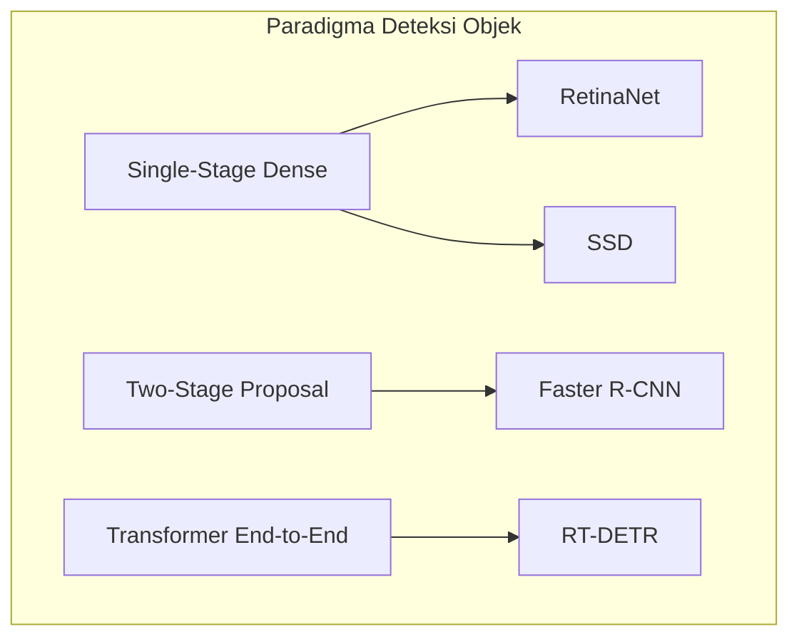

# KERANGKA RISET MODEL SELECTION: BASELINE OBJECT DETECTOR
## Klasifikasi & Deteksi Penyakit, Hama, dan Kesehatan Daun Tanaman Teh

---

## 1. Konteks Penelitian & Metodologi Seleksi Model

Penelitian ini bertujuan untuk mendeteksi penyakit, hama, dan kondisi kesehatan daun teh (*Camellia sinensis*) menggunakan pendekatan *Object Detection*. Tahapan riset saat ini difokuskan secara murni pada **FASE 2: MODEL SELECTION** tanpa modifikasi arsitektur (seperti Coordinate Attention, CBAM, BiFPN) dan tanpa pra-pemrosesan edge detection (Canny, Sobel, HED).

Tujuan utama dari tahapan seleksi model adalah membandingkan berbagai paradigma arsitektur *object detection* menggunakan dataset lokal yang sama, sehingga penentuan model terbaik didasarkan pada **bukti empiris eksperimental** dan bukan sekadar asumsi teoretis atau klaim dari paper luar.

### Profil Dataset Penelitian
- **Total Gambar**: 5.278 gambar
- **Format**: Object Detection (1 gambar $\rightarrow$ 1 bounding box mengelilingi seluruh daun $\rightarrow$ 1 kelas)
- **Rasio Imbalance**: 1 : 3.07 (antara Tea algal leaf spot 418 dan Green Mirid Bug 1282)
- **7 Kelas Dataset**:
  1. `0: Tea algal leaf spot` (418 gambar)
  2. `1: Brown Blight` (508 gambar)
  3. `2: Gray Blight` (1.013 gambar)
  4. `3: Helopeltis` (607 gambar)
  5. `4: Red Spider` (515 gambar)
  6. `5: Green Mirid Bug` (1.282 gambar)
  7. `6: Healty Leaf` (935 gambar) — *Catatan: Ejaan asli dataset dipertahankan.*
- **Pembagian Split (Grouped Stratified Split Bebas Leakage)**:
  - **Train**: 3.701 gambar (70%)
  - **Validation**: 1.048 gambar (20%)
  - **Test**: 529 gambar (10%) — *Held-out test set terisolasi.*

---

## 2. Landasan Teori Mendalam 4 Arsitektur Baseline

Berikut adalah kajian ilmiah mendalam dari keempat arsitektur object detection yang diuji berdasarkan paper asli masing-masing:



---

### A. RetinaNet (Lin et al., ICCV 2017)
**Referensi Utama**: Lin, T. Y., Goyal, P., Girshick, R., He, K., & Dollár, P. (2017). "Focal loss for dense object detection." *Proceedings of the IEEE International Conference on Computer Vision (ICCV)*, pp. 2980-2988.

#### 1. Arsitektur & Komponen Utama
- **Backbone**: ResNet-50 sebagai *bottom-up pathway*, mengekstraksi hierarki fitur konvolusional multi-skala pada tahapan $C_3, C_4, C_5$.
- **Feature Pyramid Network (FPN)**: Jalur *top-down* dan koneksi lateral ($1\times 1$ konvolusi + *nearest-neighbor upsampling* + $3\times 3$ konvolusi) yang memadukan fitur semantik tingkat tinggi dengan resolusi spasial tingkat rendah. FPN membangun piramida fitur dari $P_3$ hingga $P_7$ dengan dimensi kanal seragam ($C = 256$).
- **Classification Subnet**: FCN kecil yang terpasang di setiap tingkat piramida $P_i$. Terdiri dari 4 lapis konvolusi $3\times 3$ (256 filter, ReLU) diikuti oleh 1 lapis konvolusi $3\times 3$ dengan $K \times A$ filter ($K=7$ kelas, $A=9$ *anchor* per posisi spasial) menggunakan fungsi aktivasi Sigmoid.
- **Box Regression Subnet**: FCN paralel dengan struktur serupa (4 lapis konvolusi $3\times 3$, 256 kanal) yang diakhiri dengan konvolusi $3\times 3$ berbobot $4A$ filter linier untuk memprediksi offset relatif $(\Delta x, \Delta y, \Delta w, \Delta h)$ terhadap anchor box. Bobot subnet ini tidak dibagikan dengan subnet klasifikasi, namun dibagikan di seluruh level FPN.

#### 2. Formulasi Matematis Focal Loss
Masalah utama pada *dense single-stage detector* adalah ketimpangan ekstrem antara jutaan background anchor kandidat (sampel mudah) dan segelintir foreground object (sampel positif). Lin et al. merumuskan **Focal Loss**:

$$\text{FL}(p_t) = -\alpha_t (1 - p_t)^\gamma \log(p_t)$$

Di mana:
- $p \in [0, 1]$ adalah estimasi probabilitas model untuk kelas ground truth.
- $p_t = p$ jika $y = 1$, dan $p_t = 1 - p$ jika $y = 0$.
- $\gamma$ (*focusing parameter*, umumnya $\gamma = 2.0$) berfungsi mendiskon kontribusi loss dari sampel mudah ($p_t \to 1$). Sebagai contoh, jika $p_t = 0.99$, faktor $(1 - 0.99)^2 = 0.0001$ menekan gradien loss hingga $10.000\times$.
- $\alpha_t$ (*balancing factor*, umumnya $\alpha = 0.25$) menyeimbangkan rasio kelas positif/negatif.

#### 3. Kelebihan, Kekurangan, dan Relevansi untuk Dataset Daun Teh
- **Kelebihan**: Sangat tangguh terhadap *foreground-background imbalance*; fitur piramidal FPN menangkap daun dari berbagai sudut pengambilan foto.
- **Kekurangan**: Beban komputasi inferensi relatif tinggi karena mengevaluasi $A=9$ anchor per sel di 5 tingkat piramida; sensitif terhadap hyperparameter anchor.
- **Relevansi Dataset Teh**: Mampu mendeteksi daun teh tunggal di tengah latar belakang daun-daun lain pada kanopi kebun teh berkat redaman latar belakang oleh Focal Loss.

---

### B. SSD: Single Shot MultiBox Detector (Liu et al., ECCV 2016)
**Referensi Utama**: Liu, W., Anguelov, D., Erhan, D., Szegedy, C., Reed, S., Fu, C. Y., & Berg, A. C. (2016). "SSD: Single shot multibox detector." *European Conference on Computer Vision (ECCV)*, pp. 21-37.

#### 1. Arsitektur & Multi-Scale Feature Maps
- **Base Network**: VGG-16 terpotong (*truncated*), di mana lapisan *fully connected* (fc6 dan fc7) dikonversi menjadi lapisan konvolusional (conv6 dan conv7).
- **Multi-Scale Feature Layers**: Menambahkan lapisan konvolusi tambahan yang secara progresif mengecilkan ukuran spasial:
  - `conv4_3` ($38\times 38$)
  - `conv7` ($19\times 19$)
  - `conv8_2` ($10\times 10$)
  - `conv9_2` ($5\times 5$)
  - `conv10_2` ($3\times 3$)
  - `conv11_2` ($1\times 1$)
- **Default/Prior Boxes**:
  Setiap sel spasial pada feature map tingkat $k$ mengasosiasikan sekumpulan kotak prior dengan skala teratur:
  
  $$s_k = s_{\min} + \frac{s_{\max} - s_{\min}}{m - 1}(k - 1), \quad s_{\min}=0.2, \, s_{\max}=0.9$$
  
  dengan rasio aspek $a_r \in \{1, 2, 3, \frac{1}{2}, \frac{1}{3}\}$. Dimensi kotak default dihitung sebagai $w_k^a = s_k \sqrt{a_r}$ dan $h_k^a = s_k / \sqrt{a_r}$.
- **Classification & Regression Branch**:
  Menggunakan filter konvolusi kecil $3\times 3$ langsung pada feature map untuk memprediksi $(c \times k)$ skor kategori (dengan $c = K + 1 = 8$ kelas, termasuk latar belakang) dan $(4 \times k)$ offset koordinat.
- **Hard Negative Mining**: Mengurutkan prior boxes latar belakang berdasarkan error loss tertinggi dan membatasi rasio negatif-ke-positif maksimal 3:1 selama proses training.

#### 2. Kelebihan, Kekurangan, dan Efisiensi
- **Kelebihan**: Struktur *feedforward convolutional* murni tanpa dependensi proposal; komputasi ringan dan sangat efisien untuk perangkat *embedded*.
- **Kekurangan**: Tidak memiliki mekanisme *top-down feature fusion* (seperti FPN). Lapisan fitur bawah (`conv4_3`) memiliki resolusi spasial tinggi namun miskin informasi semantik abstrak, sehingga performa pada objek kecil atau lesi samar cenderung lebih rendah.
- **Relevansi Dataset Teh**: Memberikan baseline efisiensi ekstrem untuk memvalidasi apakah arsitektur ringan tanpa piramida fitur memadai untuk deteksi daun teh.

---

### C. Faster R-CNN (Ren et al., NeurIPS 2015)
**Referensi Utama**: Ren, S., He, K., Girshick, R., & Sun, J. (2015). "Faster R-CNN: Towards real-time object detection with region proposal networks." *Advances in Neural Information Processing Systems (NeurIPS)*, 28.

#### 1. Paradigma Two-Stage Detection
Faster R-CNN membagi proses deteksi menjadi dua tahapan independen:
1. **Tahap 1: Region Proposal Network (RPN)**
   - Jaringan konvolusional kecil ($3\times 3$ konvolusi dengan 512 kanal) menggeser (*sliding window*) pada feature map backbone (ResNet-50-FPN).
   - Di setiap posisi anchor, RPN memprediksi skor objektivitas (*objectness score*: foreground vs background) dan regresi kotak proposal awal.
   - Proposal disaring menggunakan Non-Maximum Suppression (NMS) untuk menghasilkan ~2.000 proposal pada fase training dan ~1.000 proposal pada fase inferensi.
2. **Tahap 2: RoIAlign & Fast R-CNN Head**
   - **RoIAlign** (He et al., ICCV 2017): Menggantikan RoIPooling tradisional dengan interpolasi bilinear untuk mempertahankan resolusi koordinat sub-piksel tanpa kuantisasi bulat.
   - Fitur berukuran tetap ($7\times 7 \times 256$) dialirkan ke *fully connected head* dua lapis untuk memprediksi probabilitas Softmax atas $K + 1 = 8$ kelas dan regresi bounding box per-kelas.

#### 2. Loss Function Multi-Task
Faster R-CNN dioptimalkan secara simultan dengan *joint loss*:

$$L(\{p_i\}, \{t_i\}) = \frac{1}{N_{\text{cls}}} \sum_i L_{\text{cls}}(p_i, p_i^*) + \lambda \frac{1}{N_{\text{reg}}} \sum_i p_i^* L_{\text{reg}}(t_i, t_i^*)$$

Di mana $L_{\text{cls}}$ adalah log loss atas dua kelas (objek vs bukan objek pada RPN), dan $L_{\text{reg}}$ adalah Smooth L1 loss yang hanya aktif bila $p_i^* = 1$ (anchor positif).

#### 3. Kelebihan, Kekurangan, dan Biaya Komputasi
- **Kelebihan**: Lokalisasi kotak pembatas sangat akurat karena mengalami *refinement* dua kali (di RPN dan Fast R-CNN Head); fitur RoI yang dipotong memperkecil interferensi latar belakang.
- **Kekurangan**: Latensi inferensi tinggi akibat arsitektur dua tahap sekuensial (Backbone $\to$ RPN $\to$ NMS proposal $\to$ RoIAlign $\to$ Fast Head $\to$ Final NMS); ukuran parameter besar (~41,5 juta parameter); kurang ramah untuk inferensi real-time *mobile/edge*.

---

### D. RT-DETR (Lv et al., CVPR 2023)
**Referensi Utama**: Lv, W., Zhao, Y., Xu, S., Wei, T., Wang, G., Lai, C., Cui, Q., Deng, Y., & Dang, Q. (2023). "DETRs Beat YOLOs on Real-time Object Detection." *Proceedings of the IEEE/CVF Conference on Computer Vision and Pattern Recognition (CVPR)* / arXiv:2304.08069.

#### 1. Paradigma End-to-End Tanpa NMS
Detektor konvensional (YOLO, SSD, RetinaNet, Faster R-CNN) bergantung pada NMS untuk membuang deteksi duplikat. NMS memiliki latensi yang fluktuatif tergantung kepadatan objek dalam frame. RT-DETR mengeliminasi NMS secara tuntas melalui formulasi *set prediction* langsung.

#### 2. Inovasi Arsitektur
- **Backbone**: ResNet-50 / HGNetv2 mengekstraksi multi-scale features $\{S_3, S_4, S_5\}$.
- **Efficient Hybrid Encoder**:
  Transformer encoder standar memiliki kompleksitas komputasi kuadratik $O(L^2)$ terhadap panjang sekuens token. RT-DETR mendekomposisi pemrosesan menjadi:
  1. **AIFI (Attention-based Intra-scale Feature Interaction)**: Menerapkan *single-scale Transformer self-attention* hanya pada tingkat fitur tertinggi ($S_5$), tempat informasi semantik terkonsentrasi dan jumlah token paling ringkas.
  2. **CCFM (CNN-based Cross-scale Feature-fusion Module)**: Menggabungkan fitur multi-skala menggunakan blok konvolusi efisien (RepBlocks / PANet), menghindari perhatian multi-skala yang boros memori.
- **Transformer Decoder & Query Selection**:
  Menggunakan *dynamic query selection* untuk memilih *object queries* awal dari fitur encoder yang berprobabilitas tinggi. Decoder melakukan cross-attention iteratif terhadap representasi fitur encoder.
- **Hungarian Bipartite Matching**:
  Selama pelatihan, loss dihitung dengan mencocokkan prediksi dan ground truth secara global melalui algoritma Hungarian:
  
  $$\hat{\sigma} = \arg\min_{\sigma \in \mathfrak{S}_N} \sum_{i=1}^N \mathcal{L}_{\text{match}}(y_i, \hat{y}_{\sigma(i)})$$
  
  Memastikan setiap objek daun hanya memiliki satu prediksi unik tanpa menghasilkan kotak tumpang tindih.

#### 3. Kelebihan, Kekurangan, dan Perbandingan dengan CNN
- **Kelebihan**: *Global receptive field* dari mekanisme attention menangkap konteks daun secara holistik; tidak memerlukan tuning hyperparameter NMS (IoU threshold/conf threshold); inferensi end-to-end murni.
- **Kekurangan**: Membutuhkan akselerasi operasi perkalian matriks (GEMM) yang intensif; kebutuhan memori bandwidth tinggi; konvergensi training cenderung membutuhkan epoch yang stabil.

---

## 3. Protokol Eksperimen & Perbandingan yang Adil (Fair Benchmarking)

Untuk menjamin validitas ilmiah dan mencegah bias, seluruh model diuji dalam kondisi yang terkontrol ketat:

| Komponen | Standarisasi Protokol | Rasionale / Catatan |
|---|---|---|
| **Dataset** | `tea_yolo/` | Dataset identik untuk seluruh model |
| **Split Dataset** | Train: 3701, Val: 1048, Test: 529 | Hasil Grouped Stratified Split Fase 1 |
| **Random Seed** | 42 | Reproducibility pada inisialisasi bobot dan pengacakan batch |
| **Pretrained Weights** | MS COCO Pretrained | Transfer learning standar industri |
| **Image Resolution** | 640×640 | Resolusi 640x640 dipertahankan sesuai instruksi dosen pembimbing |
| **Batch Size** | 4 | Batasan memori hardware CPU/RAM terpasang |
| **Epochs** | 50 Epochs | Titik evaluasi baseline yang seragam |
| **Augmentation** | Horizontal Flip ($p=0.5$), Normalisasi | Augmentasi dasar yang adil; tanpa Mosaic/MixUp asimetris |
| **Evaluasi Test Set** | Strict Post-Training Only | Test set TIDAK PERNAH dilihat selama pelatihan maupun tuning hyperparameter |

---

## 4. Struktur Modul Kode Model Selection

Seluruh model dan skrip evaluasi telah dibangun secara modular di dalam paket Python `model_selection/`:

```
d:/SKRIPSI/model_selection/
├── __init__.py                  # Registrasi package
├── config.py                    # Konfigurasi parameter terpusat & nama kelas asli
├── dataset.py                   # PyTorch Dataset adapter (YOLO txt -> xyxy, fair transform)
├── models.py                    # Model factory (RetinaNet, SSD, Faster R-CNN, RT-DETR, YOLO26n)
├── train_detector.py            # Unified training pipeline dengan validation monitoring
├── evaluate_detector.py         # Evaluator test set (mAP, per-kelas, efisiensi, confusion matrix)
├── visualize_predictions.py     # Analisis visual kualitatif (TP, FP, FN, Misclass, Localization)
└── run_all_experiments.py       # Master orchestrator dengan proteksi Dry-Run
```

---

## 5. Format Target Laporan Hasil Eksperimen

Setelah seluruh pelatihan baseline dijalankan, hasil empiris akan dirangkum ke dalam tabel komparasi berikut:

| Model | Precision | Recall | F1-Score | mAP@0.50 | mAP@0.50:0.95 | Params (M) | GFLOPs | Latency (ms) | FPS | Model Size (MB) |
|---|---|---|---|---|---|---|---|---|---|---|
| **RetinaNet** | *TBD* | *TBD* | *TBD* | *TBD* | *TBD* | ~34.0 | ~150 | *TBD* | *TBD* | ~130 |
| **SSD300** | *TBD* | *TBD* | *TBD* | *TBD* | *TBD* | ~35.6 | ~62 | *TBD* | *TBD* | ~140 |
| **Faster R-CNN**| *TBD* | *TBD* | *TBD* | *TBD* | *TBD* | ~41.5 | ~180 | *TBD* | *TBD* | ~160 |
| **RT-DETR-L** | *TBD* | *TBD* | *TBD* | *TBD* | *TBD* | ~32.0 | ~110 | *TBD* | *TBD* | ~125 |
| **YOLO26n\*** | *TBD* | *TBD* | *TBD* | *TBD* | *TBD* | ~2.57 | ~6.2 | *TBD* | *TBD* | ~5.5 |

*\*YOLO26n sebagai kandidat pembanding ultra-ringan.*

### Evaluasi Khusus: Deteksi Kebingungan Antar Kelas
Metrik per-kelas akan dievaluasi secara khusus untuk menganalisis apakah model mampu memisahkan kelas yang memiliki kemiripan morfologi lesi:
- **Helopeltis vs Green Mirid Bug**: Area potensi near-duplicate cross-class.
- **Gray Blight vs Brown Blight**: Kemiripan pola nekrotik pada daun teh.
- **Tea algal leaf spot**: Kelas minoritas (418 gambar) untuk mengevaluasi resistensi terhadap class imbalance.

---

## 6. Protokol Kontrol Eksekusi: 1 Model Per Tahap (Step-by-Step)

Sesuai permintaan riset agar **model tidak langsung dijalankan bergantian secara otomatis**, sistem orkestrator [`run_all_experiments.py`](file:///d:/SKRIPSI/model_selection/run_all_experiments.py) telah dilengkapi dengan mekanisme jeda (pause) dan seleksi individual:

1. **Mode Model Tunggal (Single Model Mode):**
   Pengguna dapat menjalankan satu model secara spesifik (misal RetinaNet saja). Setelah training, evaluasi test set, dan analisis visual selesai 100%, sistem akan langsung berhenti (exit) sehingga pengguna dapat memeriksa metrik dan visualisasi tanpa khawatir model lain mulai berjalan sendiri.
   ```bash
   python -m model_selection.run_all_experiments --model retinanet --run-now
   ```

2. **Mode Menu Interaktif (Interactive Controller):**
   Menampilkan antarmuka terminal untuk memilih model satu per satu berdasarkan status pengerjaan:
   ```
   [1] RetinaNet (ResNet-50-FPN)      [BELUM DIUJI]
   [2] SSD (SSD300-VGG16)             [BELUM DIUJI]
   [3] Faster R-CNN (ResNet-50-FPN)   [BELUM DIUJI]
   [4] RT-DETR (RT-DETR-L)            [BELUM DIUJI]
   [5] YOLO26n Baseline               [BELUM DIUJI]
   ```
   Setelah model pilihan selesai dieksekusi, sistem masuk ke kondisi **PAUSE** dan menunggu konfirmasi eksplisit dari pengguna (`Tekan ENTER untuk kembali ke menu...`).

3. **Pelacak Status Progres (Experiment Status Tracker):**
   Status setiap model dicatat secara persisten ke dalam [`phase2_runs/model_selection/experiment_status.json`](file:///d:/SKRIPSI/phase2_runs/model_selection/experiment_status.json) lengkap dengan timestamp penyelesaian.

---

## 7. Struktur Direktori Terisolasi & Laporan Khusus Per-Model

Untuk memastikan data tidak bercampur dan setiap eksperimen terdokumentasi secara mandiri, setiap model disimpan dalam **direktori khususnya masing-masing**, dan sistem secara otomatis mengompilasi berkas **`laporan_hasil_run.md`** di dalam folder tersebut:

```text
phase2_runs/model_selection/
├── retinanet/
│   ├── best_checkpoint.pth             # Bobot terbaik model
│   ├── last_checkpoint.pth             # Bobot epoch terakhir
│   ├── training_history.csv            # Rekaman loss & mAP per epoch
│   ├── learning_curves.png             # Grafik kurva training & validation
│   ├── test_evaluation_summary.json   # Rekap numerik metrik test set
│   ├── confusion_matrix.png            # Visual peta kebingungan prediksi
│   ├── confusion_matrix.csv            # Matriks numerik prediksi kelas
│   ├── visual_analysis/                # Folder sampel gambar test set
│   │   ├── true_positive.png
│   │   ├── false_negative.png
│   │   ├── misclassification.png
│   │   └── localization_error.png
│   └── laporan_hasil_run.md            # <-- LAPORAN LENGKAP HASIL RUN MODEL INI
│
├── ssd/
│   └── ... (berkas terisolasi & laporan_hasil_run.md)
├── faster_rcnn/
│   └── ... (berkas terisolasi & laporan_hasil_run.md)
├── rtdetr/
│   └── ... (berkas terisolasi & laporan_hasil_run.md)
├── yolo26n/
│   └── ... (berkas terisolasi & laporan_hasil_run.md)
└── experiment_status.json              # Tracker progres antrean eksperimen
```

---

## 8. Status Kesiapan Eksekusi

Sesuai instruksi: **"anda cukup membuatkan modelnya saja, jangan dirun dahulu"**:
1. Seluruh arsitektur model baseline telah dibangun dan terintegrasi dengan dataset `tea_yolo`.
2. Seluruh modul training, evaluasi test set, confusion matrix, dan visual error analysis telah selesai dibuat dan diverifikasi sintaksnya.
3. Eksekusi training berada dalam mode siaga (**READY-TO-RUN**) dan **TIDAK DIJALANKAN** sampai ada instruksi eksplisit dari pengguna.
